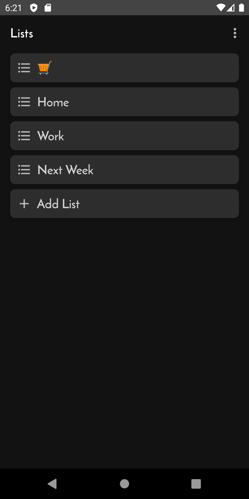

<p align = "center">
  
  </p>

<p align = "center">
  <a href="#description">Description</a> -
  <a href="#tech">Tech</a> -
  <a href="#screenshots">Screenshots</a> -
  <a href="#license">License</a>
  </p>


# Description

DoitToit was made as part of a coding challenge for Branch Payments. Able to create many Lists of To-Dos, I had a lot of fun with this project and it
gave me the chance to learn some new things! Such as:
- I fell in love with Kotlin Flows while working on this project, as I hadn't previously used them much. Asynchronous sequential streams for 
 updates from the database!? Awesome!
- I chose to use a modular architecture to separate concerns, but was excited to learn how to implement Navigation Component in a multi-module project.
- I also spent more time on design and the overall asthetics in this project. Theme Inheritance, to be specific.
- Another feature I'm proud of is using ItemTouchHelper to implement
a swipe-to-delete function, as well as showing a classic "UNDO" snackbar for those pesky swiping mistakes! Cool!

I did encounter a few struggles, the most disappointing being testing. I had planned to unit-test my ViewModels, and then do some instrumented tests
on the databases. My hope was to assert that TaskEntity and ListEntity maintained integrity up on insertion and retrieval from the database using a 
FakeRepository.  As I began, I realized that the with the  heavy use of Flow and LiveData in my app, testing would require some special provisions that I didn't 
have time to read up on. Another was in the checkboxes on the Tasks. When checked, it updates a var in the TaskEntity and an onCheckChangedListener then updates it in Room. The change in the database triggers a Flow collection and the list gets updated causing the item to be redrawn in the Recycler View and subsequently a quick flash. I think the solution is holding the value somewhere and updating room when the page was navigated away from. I realized this too late in the challenge to implement.

Last thing - I realize the logo should have had a hyphen "Do-it To-it" so it doesn't sound-look like "dɔɪt tɔɪt"(phonetics). And Capital I's(eyes) look like l's(ells) in that font, so capitalizing them wouldn't have been any better. One day I'll make a new logo for it.:)


# Tech
<h5>Material Design</h5> For predictable, well-designed and
aesthetically pleasing user interfaces.
<h5>Room</h5> A persistence library that provides an abstraction layer over SQLite to assist
 in storing and retrieving lists and tasks to the disk.
<h5>LiveData</h5> Used to emit and observe streams of data in realtime to update the UI while remaining
LifeCycle aware.
<h5>Kotlin Flow</h5> Flow is a "cold" stream that produces values asynchronously and sequentially. Super Cool! Built on
  top of coroutines, it's my new favorite thing! Used to keep lifecycle-aware Livedata out of my repository layer.
<h5>Coroutines</h5> Asynchronous operations handled by Kotlin Coroutines. Keeping database queries and
other heavy lifting off of the main thread for an uninterrupted user experience while also
reducing the need for callbacks.
<h5>Dagger Hilt</h5> A fully static, compile-time Dependency Injection framework.
<h5>MVVM</h5> ViewModel used to keep data alive and accessible through configuration and LifeCycle changes.
<h5>RecyclerView</h5> Used to efficiently display variable lists with the help of DiffUtil to cut down on updating costs.
<h5>Navigation Component</h5> Used to handle navigation and the passing of data between destinations
<h5>Android KTX</h5> Helping to write more concise and idiomatic Kotlin code.


# Screenshots
<p align = "center">





  </p>


# License
```
MIT License

Copyright (c) 2021 Joshua Swigut

Permission is hereby granted, free of charge, to any person obtaining a copy
of this software and associated documentation files (the "Software"), to deal
in the Software without restriction, including without limitation the rights
to use, copy, modify, merge, publish, distribute, sublicense, and/or sell
copies of the Software, and to permit persons to whom the Software is
furnished to do so, subject to the following conditions:

The above copyright notice and this permission notice shall be included in all
copies or substantial portions of the Software.

THE SOFTWARE IS PROVIDED "AS IS", WITHOUT WARRANTY OF ANY KIND, EXPRESS
OR IMPLIED, INCLUDING BUT NOT LIMITED TO THE WARRANTIES OF
MERCHANTABILITY, FITNESS FOR A PARTICULAR PURPOSE AND NONINFRINGEMENT.
IN NO EVENT SHALL THE AUTHORS OR COPYRIGHT HOLDERS BE LIABLE FOR ANY
CLAIM, DAMAGES OR OTHER LIABILITY, WHETHER IN AN ACTION OF CONTRACT,
TORT OR OTHERWISE, ARISING FROM, OUT OF OR IN CONNECTION WITH THE
SOFTWARE OR THE USE OR OTHER DEALINGS IN THE SOFTWARE.
